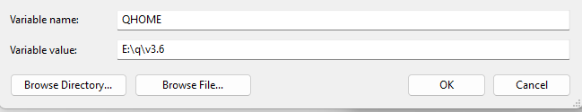

+++
author = "Tao Shawn"
title = "KDB Q deployment"
date = "2023-09-14"
description = "My kdb+ setting and deployment ."
tags = [
    "personal setting",
    "deployment",
    "q.exe",
]
categories = [
    "kdb",
    "experience",
]
series = ["Themes Guide"]
aliases = ["kx system logo"]
image = "images/kdbinfo.png"
+++

This is my deployment of kdb q. 
<!--more-->

## Linux deployment
Reference on how to have multiple version of kdb (kdb version and bit version): [multiVersion](https://code.kx.com/q/kb/versions)

sample dir:
```
$ tree q
q
├── k4.lic
├── v3.5
│   ├── m32
│   │   └── q
│   ├── m64
│   │   └── q
│   └── q.k
└── v4.0
    ├── m64
    │   └── q
    └── q.k
```
In this environment, two version of 64 bit q binary and one 32 bit q binary are available. But the
```
q
```
command will call the one with alias. To have access to multiple version access, we can set alias shortcut as q32 q64 etc.
```
export QLIC=~/q
alias    q='export QHOME=~/q/v4.0; rlwrap -r $QHOME/m64/q'
alias q3.5='export QHOME=~/q/v3.5; rlwrap -r $QHOME/m64/q'
alias  q32='export QHOME=~/q/v3.5; rlwrap -r $QHOME/m32/q'
```
## windows deployment
Windows defers from Linux, environment varibale redefine requires shell to reopen.

We need to set different environment to start correspnoding q.exe.

The "QHOME" envrionment is the core to startup a q.exe, as it not only defines the loading directory but also determines the q.exe path. 



Add the following to path:
```
%QHOME%/w32
```

